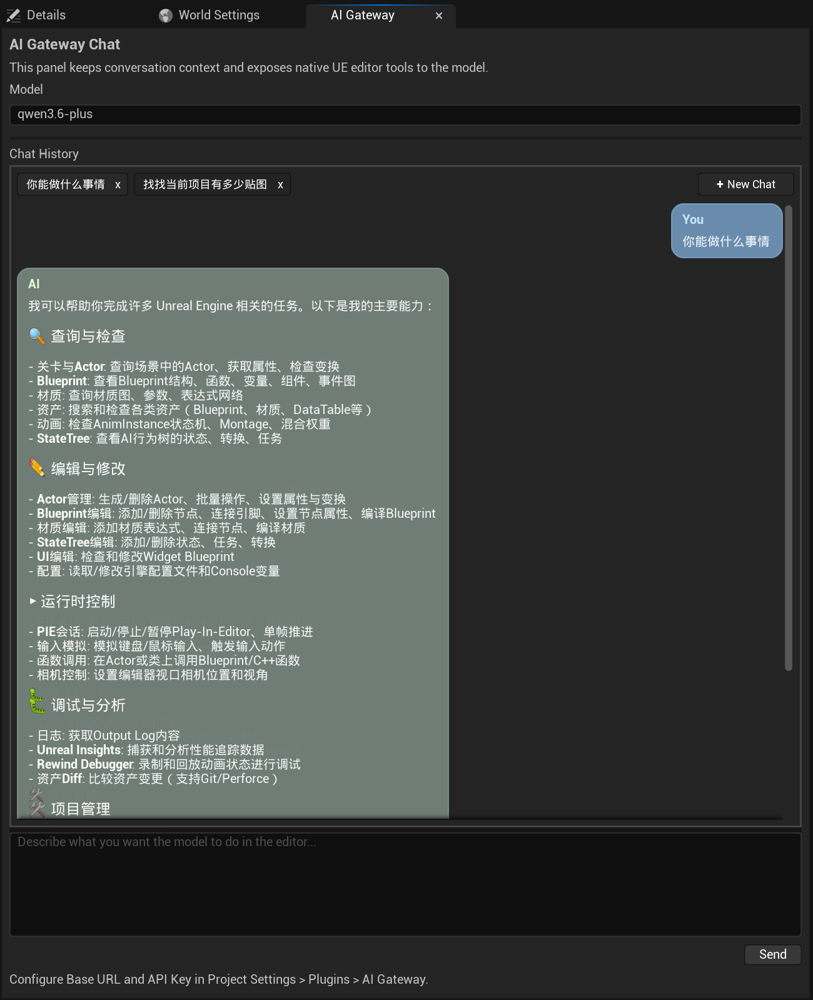

# AI Gateway Editor for Unreal Engine 5

AI Gateway Editor 是一个实验性的 Unreal Engine 5 编辑器插件，它把 OpenAI 兼容的聊天体验直接带进 UE 编辑器内部，并让大模型可以在进程内调用原生 Unreal 编辑器工具。

这个项目现在已经整合了来自 [`soft-ue-cli`](https://github.com/softdaddy-o/soft-ue-cli) 仓库中的 UE 侧代码、设计思路和工具体系。特别是本插件中的 `SoftUEBridge` 和 `SoftUEBridgeEditor` 模块，已经作为向模型暴露编辑器操作能力的重要 Unreal 侧基础设施被集成进来。

它不再只是一个简单的聊天窗口，而是把编辑器变成了一个 AI 辅助工作台：

- 可以连接任意 OpenAI 兼容的 `/chat/completions` 网关
- 在多轮对话中保留上下文
- 在编辑器 UI 中流式显示模型输出
- 按项目本地持久化多个聊天会话
- 通过 OpenAI 风格的 `tools` / `tool_calls` 让模型调用原生 Unreal 工具
- 对敏感操作提供内联确认
- 在同一个面板里完成查询、检查和修改 UE 编辑器状态

## 界面截图



下图展示了插件在 Unreal Editor 内的聊天面板界面，包括多会话页签、支持 Markdown 的助手消息卡片，以及停靠在编辑器中的输入区域。

## 这个插件能做什么

从整体上看，这个插件由三部分组成：

1. 内嵌在编辑器中的聊天 UI
2. 支持流式输出和工具调用的 OpenAI 兼容聊天客户端
3. 向模型暴露编辑器能力的原生 Unreal 工具运行时

这意味着你可以直接在 Unreal Editor 中打开一个面板，要求模型检查当前关卡、查询资源、分析 Blueprint、控制 PIE，或者执行其他编辑器操作，而插件会在编辑器进程内部直接执行这些受支持的工具能力。

当前版本的编辑器内工作流不要求额外跑一个外部 MCP sidecar。工具运行时直接宿主在插件内部，并桥接到 Unreal 原生功能。

## 上游仓库与代码来源

这个仓库并不是一个完全从零开始的 clean-room 实现。

它明确复用了并改造了 [`soft-ue-cli`](https://github.com/softdaddy-o/soft-ue-cli) 中与 Unreal 相关的代码和设计，重点包括：

- UE 工具的分类方式和命名约定
- bridge 侧的编辑器操作模式
- 通过 `SoftUEBridge` 和 `SoftUEBridgeEditor` 暴露原生 Unreal 工具的实现方式

在当前版本中，我们并不是把那个项目的 Python CLI 或外部 MCP Server 作为主要运行路径直接搬进来，而是把其中 Unreal 侧有价值的能力集成进了本插件，让工具能够在编辑器内部进程内执行。

## 核心功能

### 编辑器内聊天面板

- 可停靠的 `AI Gateway` 标签页
- `Window` 菜单中的入口
- Play 工具栏区域里的额外入口按钮
- 支持 Enter 直接发送
- 采用类似 ChatGPT 的消息卡片式布局，而不是一个大文本框
- 用户消息和助手消息都有圆角卡片
- 消息文本支持选择
- 消息卡片支持右键整条复制

### 多会话聊天

- 使用类似浏览器页签的顶部标签栏管理多个会话
- 可以新建、切换、关闭聊天会话
- 会话标题根据首条用户消息在本地自动生成
- 切换标签时保留当前会话草稿
- 请求中或等待工具审批时，会阻止切换/关闭/新建，避免状态串线

### 本地持久化

- 会话按 Unreal 项目本地保存
- 存储位置：
  - `Saved/AIGatewayEditor/Chats/index.json`
  - `Saved/AIGatewayEditor/Chats/<SessionId>.json`
- 编辑器重启后自动恢复
- 同时持久化 UI 可见的聊天记录和模型请求上下文

### OpenAI 兼容聊天集成

- 通过 `POST {BaseUrl}/chat/completions` 发请求
- 使用 Bearer Token 方式附带 API Key
- 支持标准 assistant 回复
- 支持流式响应
- 支持 OpenAI 风格的 `tools` 与 `tool_calls`
- 当网关响应格式错误或不支持工具调用时，会在面板中给出明确错误提示

### 原生 Unreal 工具调用

- 每次请求都会附带工具定义
- 同时支持从普通响应和流式响应中解析 `tool_calls`
- 工具调用按顺序在编辑器内执行
- 工具结果会以 `role=tool` 的方式回灌给模型
- 插件会持续执行 tool loop，直到得到最终 assistant 回复
- 工具上下文会保存在请求历史里，但不会污染聊天记录可见区域

### 安全与审批

只读工具会直接执行。

敏感工具会在聊天面板中要求用户进行显式确认，例如：

- `delete-actor`
- `batch-delete-actors`
- `start-pie`
- `stop-pie`
- `pie-session`

如果用户拒绝某个工具调用，拒绝结果也会被干净地回灌进 tool loop，让模型基于这个结果继续工作。

### 面向 Markdown 的聊天渲染

聊天记录的显示是按大模型常见输出形式来设计的，而不是只显示纯文本。面板当前支持的富文本展示能力包括：

- 标题
- 粗体和行内强调
- 行内代码
- fenced code block
- 链接
- 表格
- 正常文本自动换行，避免普通段落出现横向滚动条

## 支持的使用方式

推荐工作流如下：

1. 打开 `AI Gateway` 标签页
2. 在 Project Settings 中配置网关
3. 让模型分析当前 Unreal 项目或编辑器状态
4. 由模型自行决定是否要调用原生工具
5. 在需要时审批敏感操作
6. 在完整上下文保留的前提下继续多轮对话

典型例子包括：

- “列出当前关卡里的前 10 个 Actor”
- “检查当前选中的 Actor，并告诉我它的重要属性”
- “找到这个 Blueprint 并解释它的结构”
- “检查当前地图设置后启动 PIE”
- “修改某个 Blueprint 的默认值并编译”

## 工具能力覆盖范围

这个插件已经不再是最早的最小原型，而是把较完整的 Unreal 编辑器工具能力路由到了进程内工具运行时。

最终可用的工具列表是在启动时从内部 bridge registry 构建出来的，同时又补充了一些插件侧的便捷工具，例如：

- `get-selected-actors`
- `delete-actor`
- `set-actor-transform`
- `set-blueprint-default`
- `start-pie`
- `stop-pie`

实际整合进来的 Unreal 侧工具能力覆盖了很广的编辑器操作范围，包括：

- 关卡与 Actor 查询
- Actor 生成、删除、Transform 修改、属性修改
- 当前选中 Actor 查询
- Blueprint 查询、编辑相关操作、编译与保存
- 资产搜索与资产相关编辑器操作
- PIE 控制
- 截图与视口捕获
- Console Variable 与配置项相关操作
- 日志与编辑器诊断能力
- 通过集成 bridge 模块暴露出来的更多编辑器侧操作

模型看到的是 OpenAI 函数调用格式，而真正的执行是在 C++ 原生 Unreal 编辑器环境里完成的。

## 安装方式

### 方式一：作为项目插件使用

把插件复制到你的 Unreal 项目目录中：

```text
<YourProject>/Plugins/AIGatewayEditor
```

然后按需重新生成工程文件并编译编辑器目标。

### 方式二：直接基于本仓库工作

当前仓库已经包含插件目录：

```text
Plugins/AIGatewayEditor
```

你可以直接从这里打包或复制这个插件到其他 UE5 项目中测试。

## 依赖要求

- Unreal Engine 5 编辑器环境
- 一个提供 OpenAI 兼容 `/chat/completions` 接口的网关
- 对应网关可用的 API Key

这个插件当前主要面向编辑器内工作流，而不是打包后的运行时环境。

## 配置方式

打开：

`Project Settings > Plugins > AI Gateway`

配置以下项目：

- `Base URL`
- `API Key`
- `Model`

这些配置会保存在项目配置中，并且有意不放回聊天输入区域里。

## 如何打开面板

可以通过以下两个入口打开：

- `Window > AI Gateway`
- Play 工具栏区域里的 `AI Gateway` 按钮

## 聊天会话行为

每个会话都会维护两层历史：

- 一层是 UI 可见的聊天记录
- 一层是用于模型连续性的请求上下文，其中包含隐藏的 tool call 消息

这种设计可以让插件：

- 在重启后继续保留工具调用上下文
- 不把原始 tool chatter 直接显示到聊天记录里
- 让会话真正可以接着聊，而不是每次从零开始

会话标题由首条用户消息在本地生成，不再额外调用一次 AI 去命名。

## Tool Loop 行为

当模型返回 `tool_calls` 时，插件会：

1. 解析请求的工具调用
2. 按顺序逐个执行
3. 如果是敏感工具，先请求用户审批
4. 把每个工具结果作为 `role=tool` 追加回请求上下文
5. 再次把更新后的上下文发给网关
6. 重复直到网关返回最终 assistant 回复

这样可以让模型保持决策循环，而实际执行仍然发生在 Unreal Editor 内部。

## 内部架构

插件已经做过一次结构重构，主面板不再是一个巨大的单体类。

### 主要编辑器模块

- `AIGatewayEditor`
  - 聊天 UI、聊天控制器、会话持久化、网关集成，以及工具运行时包装层
- `SoftUEBridge`
  - 用于暴露编辑器操作的 Unreal bridge 层，来源于已集成的 `soft-ue-cli` UE 侧 bridge 思路与代码
- `SoftUEBridgeEditor`
  - 编辑器专用工具实现与注册集成，基于已整合的 `soft-ue-cli` Unreal 工具侧能力

### Chat 系统结构

在 `AIGatewayEditor` 内部，聊天系统按职责拆成了几层：

- `Chat/Model`
  - 消息、会话、视图状态、工具调用状态等共享类型
- `Chat/Services`
  - 会话存储与 OpenAI 兼容 HTTP 聊天服务
- `Chat/Controller`
  - 负责编排会话切换、流式响应、tool loop、审批和持久化的运行时控制器
- `Chat/Widgets`
  - 会话标签栏、消息区、输入框、工具确认条、消息卡片等 UI 组件
- `Chat/Markdown`
  - 消息显示使用的内部 markdown 解析和渲染辅助逻辑

### 稳定的内部扩展点

目前有两个内部接口被当作后续演进的正式扩展点：

- `IAIGatewayChatSessionStore`
- `IAIGatewayChatService`

这样后续如果要更换存储层或网关接入层，就不需要重写整个面板 UI。

## 当前限制

- 插件仍然处于实验阶段
- 主要面向编辑器工作流
- 网关兼容性依赖于 OpenAI 风格的 chat completions 行为
- 最好搭配真正支持 `tools` / `tool_calls` 的模型使用
- UI 和 markdown 渲染仍在持续迭代

## 仓库结构

关键路径包括：

- `Plugins/AIGatewayEditor`
- `Plugins/AIGatewayEditor/Source/AIGatewayEditor`
- `Plugins/AIGatewayEditor/Source/SoftUEBridge`
- `Plugins/AIGatewayEditor/Source/SoftUEBridgeEditor`

如果你想看整合自 `soft-ue-cli` 的主要代码，最相关的目录是：

- `Plugins/AIGatewayEditor/Source/SoftUEBridge`
- `Plugins/AIGatewayEditor/Source/SoftUEBridgeEditor`

## 这个插件的目标

AI Gateway Editor 的目标，是让 Unreal Editor 本身成为模型直接操作的工作现场，而不是把体验限制在编辑器外部的聊天窗口里，也不是在常见工作流中强依赖单独的外部编排进程。

简单来说：

- 编辑器本身仍然是主工作台
- 模型拿到的是结构化的原生工具
- 用户仍然对敏感操作保有控制权
- 对话是按项目本地持久化保存的

## 当前状态

这个项目仍在持续演进中。当前实现已经可以支撑一个实用的编辑器内 AI 工作流，但它仍然更适合被视为一个快速发展的编辑器插件，而不是一个完全定型的最终产品。
